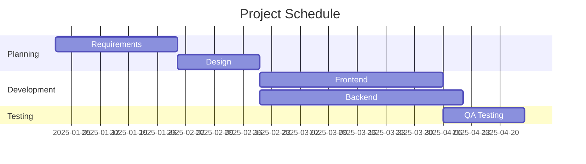
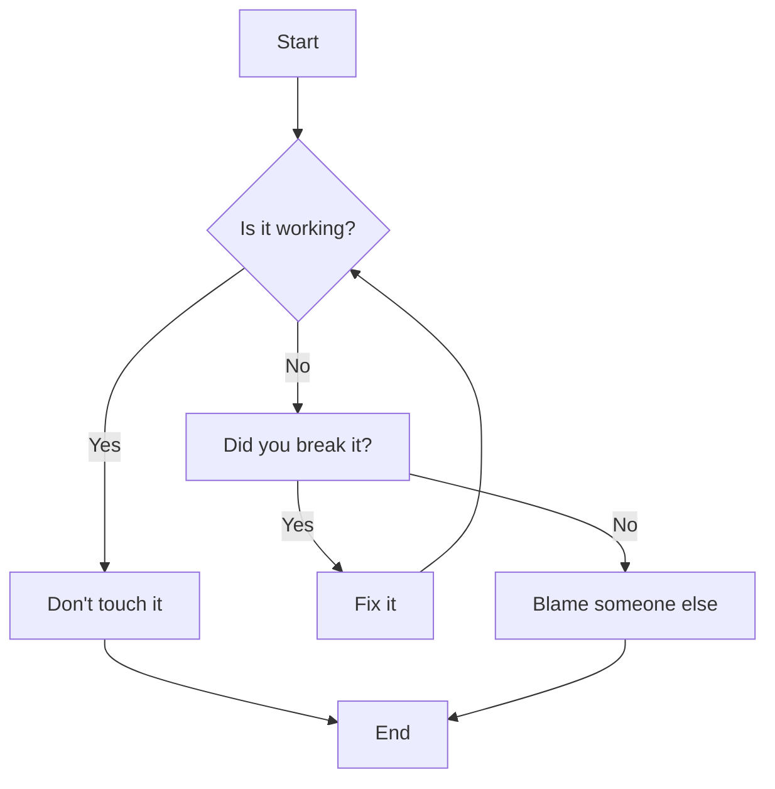
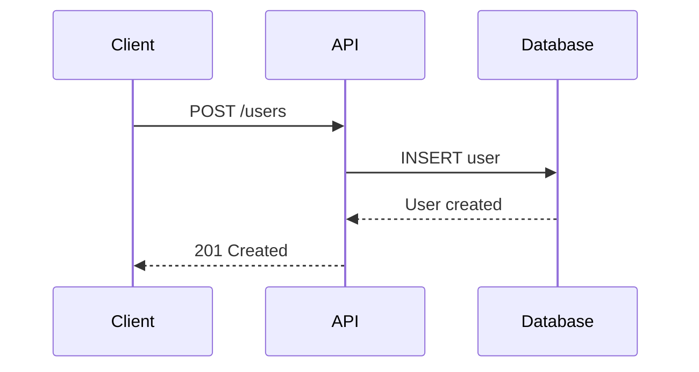
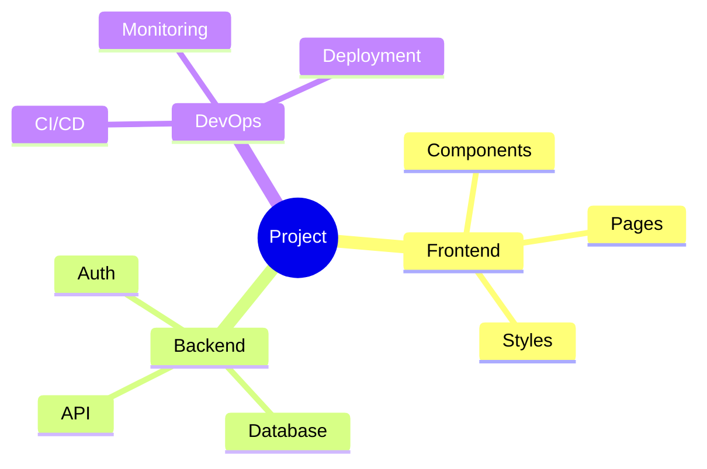

# Slidev Slide Templates

Ready-to-use slide templates for common presentation patterns.

## Title Slide Templates

### Standard Title Slide
```markdown
---
layout: cover
background: /cover-image.jpg
class: text-center
---

# Presentation Title

## Subtitle or Tagline

Your Name · Date/Event
```

### Minimal Title Slide
```markdown
---
layout: cover
class: text-center
---

# Presentation Title

By Your Name
```

### Gradient Background Title
```markdown
---
layout: cover
background: linear-gradient(135deg, #667eea 0%, #764ba2 100%)
class: text-center text-white
---

# Modern Presentation

## Innovative Solutions

Team Name · Q1 2025
```

## Section Divider Templates

### Simple Section Divider
```markdown
---
layout: section
---

# Part 2: Implementation
```

### Styled Section Divider
```markdown
---
layout: section
background: linear-gradient(to right, #4facfe, #00f2fe)
class: text-white
---

# Technical Deep Dive

Advanced concepts and patterns
```

### Numbered Section
```markdown
---
layout: section
background: /section-bg.jpg
class: text-white
---

# 03

Performance Optimisation
```

## Content Slide Templates

### Bullet Points
```markdown
---
layout: default
---

# Key Features

<v-clicks>

- Feature 1: Fast and responsive
- Feature 2: Easy to use
- Feature 3: Highly customizable
- Feature 4: Open source

</v-clicks>
```

### Two-Column Comparison
```markdown
---
layout: two-cols
---

# Traditional Approach

- Manual processes
- Time-consuming
- Error-prone
- Limited scalability

::right::

# Our Solution

- Automated workflows
- Instant results
- Reliable
- Infinitely scalable
```

### Problem-Solution
```markdown
---
layout: two-cols
---

# The Problem

Current systems struggle with:

- Performance bottlenecks
- Complex configuration
- Poor developer experience
- Limited flexibility

::right::

# The Solution

Our approach provides:

- 10x faster processing
- Zero-config setup
- Intuitive API
- Plug-and-play architecture
```

## Code Demonstration Templates

### Simple Code Block
````markdown
---
layout: default
---

# Example Code

```typescript {all|1-3|5-7|all}
interface User {
  id: number
  name: string
}

const user: User = {
  id: 1,
  name: 'Alice'
}
```
````

### Side-by-Side Code Comparison
````markdown
---
layout: two-cols
---

# Before

```javascript
var users = []
for (var i = 0; i < data.length; i++) {
  users.push(data[i].name)
}
```

::right::

# After

```javascript
const users = data.map(u => u.name)
```
````

### Live Code Editor
````markdown
---
layout: two-cols
---

# Interactive Demo

```typescript {monaco-run}{height:300px}
interface Product {
  name: string
  price: number
}

const products: Product[] = [
  { name: 'Laptop', price: 999 },
  { name: 'Mouse', price: 29 }
]

const total = products.reduce(
  (sum, p) => sum + p.price,
  0
)

console.log(`Total: $${total}`)
```

::right::

# Features

- Full TypeScript support
- IntelliSense
- Run code in browser
- Instant feedback
````

### Code with Explanation
````markdown
---
layout: two-cols
---

```python {1|3-5|7-9|all}
def fibonacci(n):
    """Calculate Fibonacci sequence"""
    if n <= 1:
        return n
    return fibonacci(n-1) + fibonacci(n-2)

# Generate first 10 numbers
for i in range(10):
    print(fibonacci(i))
```

::right::

# Breakdown

<v-clicks>

1. **Base case** - Handle n ≤ 1
2. **Recursive call** - Sum of previous two
3. **Loop** - Generate sequence

</v-clicks>
````

## Image & Media Templates

### Image with Caption
```markdown
---
layout: image-right
image: /architecture-diagram.png
backgroundSize: contain
---

# System Architecture

Our three-tier architecture ensures:

- Scalability
- Maintainability
- Performance
```

### Full-Screen Image
```markdown
---
layout: image
image: /hero-image.jpg
backgroundSize: cover
class: text-white
---

# Inspiring Quote

"Design is not just what it looks like. Design is how it works."

— Steve Jobs
```

### Video Embed
```markdown
---
layout: default
---

# Product Demo

<Youtube id="dQw4w9WgXcQ" width="800" />

Watch how our product streamlines your workflow
```

### Side-by-Side Images
```markdown
---
layout: two-cols
---


**Before**: Cluttered interface

::right::


**After**: Clean, modern design
```

## Data & Statistics Templates

### Big Number
```markdown
---
layout: fact
---

# 10,000+

Active users worldwide
```

### Statistics Grid
```markdown
---
layout: center
---

# By The Numbers

<div class="grid grid-cols-3 gap-8 text-center">
  <div>
    <div class="text-5xl font-bold text-blue-500">99.9%</div>
    <div class="text-xl mt-2">Uptime</div>
  </div>
  <div>
    <div class="text-5xl font-bold text-green-500">< 100ms</div>
    <div class="text-xl mt-2">Response Time</div>
  </div>
  <div>
    <div class="text-5xl font-bold text-purple-500">24/7</div>
    <div class="text-xl mt-2">Support</div>
  </div>
</div>
```

### Chart/Diagram
````markdown
---
layout: center
---

# Project Timeline


````

## Interactive Templates

### Navigation Menu
```markdown
---
layout: center
---

# Choose Your Path

<div class="grid grid-cols-2 gap-6 mt-12">
  <Link to="frontend" class="p-8 border-2 border-blue-500 rounded-lg hover:bg-blue-50 transition cursor-pointer">
    <h2 class="text-3xl mb-4">🎨 Frontend</h2>
    <p>React, Vue, Angular</p>
  </Link>

  <Link to="backend" class="p-8 border-2 border-green-500 rounded-lg hover:bg-green-50 transition cursor-pointer">
    <h2 class="text-3xl mb-4">⚙️ Backend</h2>
    <p>Node.js, Python, Go</p>
  </Link>
</div>
```

### Interactive Demo
```markdown
---
layout: center
---

# Try It Yourself

<div class="max-w-md mx-auto">
  <Counter :count="10" />
</div>

<!-- Requires custom Counter component in /components -->
```

### Table of Contents
```markdown
---
layout: center
---

# Agenda

<Toc minDepth="1" maxDepth="1" />
```

## Diagram Templates

### Flowchart
````markdown
---
layout: center
---

# Decision Flow


````

### Sequence Diagram
````markdown
---
layout: default
---

# API Flow


````

### Mind Map
````markdown
---
layout: center
---

# Project Structure


````

## Quote & Statement Templates

### Quotation
```markdown
---
layout: quote
---

"The only way to do great work is to love what you do."

— Steve Jobs
```

### Bold Statement
```markdown
---
layout: statement
---

# We're changing the future of development
```

### Call to Action
```markdown
---
layout: center
class: text-center
---

# Ready to Get Started?

<div class="mt-12">
  <a href="https://example.com" class="btn-primary text-2xl px-8 py-4 rounded-lg">
    Try It Free
  </a>
</div>

No credit card required · 14-day trial
```

## Closing Slide Templates

### Thank You
```markdown
---
layout: end
class: text-center
---

# Thank You!

## Questions?

Contact: your.email@example.com

Twitter: @yourhandle
```

### Next Steps
```markdown
---
layout: default
---

# Next Steps

<v-clicks>

1. **Download** the starter kit
2. **Join** our community Slack
3. **Follow** the tutorial
4. **Build** your first project

</v-clicks>

---

🔗 Links: https://example.com/get-started
```

### Contact Info
```markdown
---
layout: center
class: text-center
---

# Let's Connect

<div class="grid grid-cols-3 gap-8 mt-12 text-xl">
  <div>
    <div class="i-mdi:email text-4xl mb-2" />
    <div>hello@example.com</div>
  </div>
  <div>
    <div class="i-mdi:twitter text-4xl mb-2" />
    <div>@yourhandle</div>
  </div>
  <div>
    <div class="i-mdi:github text-4xl mb-2" />
    <div>github.com/you</div>
  </div>
</div>
```

## Advanced Pattern Templates

### Progressive Disclosure
```markdown
---
layout: default
---

# Implementation Steps

<v-clicks depth="2">

1. **Setup**
   - Install dependencies
   - Configure environment
2. **Development**
   - Write code
   - Add tests
3. **Deployment**
   - Build production
   - Deploy to server

</v-clicks>
```

### Animated Entrance
```markdown
---
layout: center
---

<div
  v-motion
  :initial="{ x: -80, opacity: 0 }"
  :enter="{ x: 0, opacity: 1, transition: { duration: 800 } }"
>

# Welcome

## Let's build something amazing

</div>
```

### Split Content with Animation
```markdown
---
layout: two-cols
---

<div v-click>

# Challenge

Current solutions are:
- Too complex
- Too expensive
- Too slow

</div>

::right::

<div v-after>

# Our Answer

We provide:
- Simplicity
- Affordability
- Speed

</div>
```

## Usage Notes

1. **Replace placeholders**: Update titles, content, paths, URLs
2. **Adjust styling**: Modify classes, colours, sizes as needed
3. **Add presenter notes**: Include `<!-- notes -->` at slide end
4. **Customize layouts**: Change layout type if needed
5. **Test thoroughly**: Preview all slides before presenting
