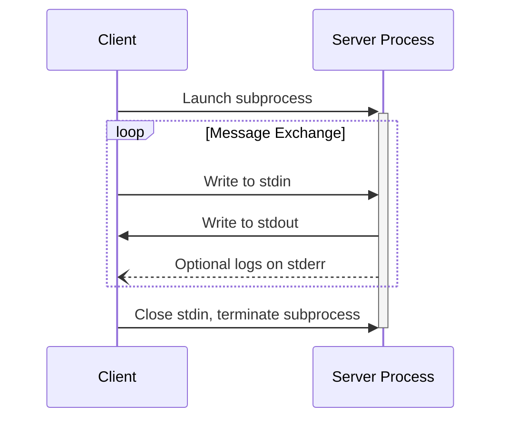

# MCP Server Development Protocol

⚠️ CRITICAL: DO NOT USE attempt_completion BEFORE TESTING ⚠️

## Step 1: Planning (PLAN MODE)

- What problem does this tool solve?
- What API/service will it use?
- Does it need to run in both stdio and SSE modes?
- What are the authentication requirements?
  □ Standard API key
  □ OAuth (requires separate setup script)
  □ Other credentials

## Step 2: Implementation (ACT MODE)

1. Bootstrap
   - For web services, JavaScript integration, or Node.js environments:
     ```bash
     npx -y @modelcontextprotocol/create-server my-server
     cd my-server
     npm install
     ```
   - For data science, ML workflows, or Python environments:
     ```bash
     pip install mcp
     # Or with uv (recommended)
     uv add "mcp[cli]"
     ```
   - For Golang:
     ```bash
     go get github.com/mark3labs/mcp-go
     ```

2. Core Implementation
   - Use MCP SDK (or go-mcp for Golang)
   - Implement comprehensive logging, ensuring that when running in stdio mode the logs are not sent to stdout/stderr.
     - TypeScript (for web/JS projects):
       ```typescript
       console.error('[Setup] Initializing server...');
       console.error('[API] Request to endpoint:', endpoint);
       console.error('[Error] Failed with:', error);
       ```
     - Python (for data/science/ML projects):
       ```python
       import logging
       logging.error('[Setup] Initializing server...')
       logging.error(f'[API] Request to endpoint: {endpoint}')
       logging.error(f'[Error] Failed with: {str(error)}')
       ```
     - Golang:
        - Fetch the go-mcp example for 'everything' located here: https://raw.githubusercontent.com/mark3labs/mcp-go/refs/heads/main/examples/everything/main.go to best understand the package.'
        - Create a Makefile that provides a single place to run lint, test and build.
        - Ensure semver is used for the resulting package build and version command.
   - Add type definitions
   - Handle errors with context
   - Implement rate limiting if needed

3. Configuration
   - Get credentials from user if needed
   - Add to MCP settings:
     - For TypeScript projects:
       ```json
       {
         "mcpServers": {
           "my-server": {
             "command": "node",
             "args": ["path/to/build/index.js"],
             "env": {
               "API_KEY": "key"
             },
             "disabled": false,
             "autoApprove": []
           }
         }
       }
       ```
     - For Python projects:
       ```bash
       # Directly with command line
       mcp install server.py -v API_KEY=key

       # Or in settings.json
       {
         "mcpServers": {
           "my-server": {
             "command": "python",
             "args": ["server.py"],
             "env": {
               "API_KEY": "key"
             },
             "disabled": false,
             "autoApprove": []
           }
         }
       }
       ```

## Step 3: Testing (BLOCKER ⛔️)

<thinking>
BEFORE using attempt_completion, I MUST verify:
□ Have I tested EVERY tool?
□ Have I confirmed success from the user for each test?
□ Have I documented the test results?

If ANY answer is "no", I MUST NOT use attempt_completion.
</thinking>

1. Test Each Tool (REQUIRED)
   □ Test each tool with valid inputs
   □ Verify output format is correct
   ⚠️ DO NOT PROCEED UNTIL ALL TOOLS TESTED

## Step 4: Completion

❗ STOP AND VERIFY:
□ Every tool has been tested with valid inputs
□ Output format is correct for each tool

Only after ALL tools have been tested can attempt_completion be used.

## MCP stdio mode


MCP uses JSON-RPC to encode messages. JSON-RPC messages **MUST** be UTF-8 encoded.

The protocol currently defines two standard transport mechanisms for client-server
communication:

1. [stdio](#stdio), communication over standard in and standard out
2. [Streamable HTTP](#streamable-http)

Clients **SHOULD** support stdio whenever possible.

It is also possible for clients and servers to implement
[custom transports](#custom-transports) in a pluggable fashion.

## stdio

In the **stdio** transport:

- The client launches the MCP server as a subprocess.
- The server reads JSON-RPC messages from its standard input (`stdin`) and sends messages
  to its standard output (`stdout`).
- Messages are individual JSON-RPC requests, notifications, or responses.
- Messages are delimited by newlines, and **MUST NOT** contain embedded newlines.
- The server **MAY** write UTF-8 strings to its standard error (`stderr`) for logging
  purposes. Clients **MAY** capture, forward, or ignore this logging.
- The server **MUST NOT** write anything to its `stdout` that is not a valid MCP message.
- The client **MUST NOT** write anything to the server's `stdin` that is not a valid MCP
  message.



## Key Requirements

- ✓ Must use MCP SDK, or if in Golang the go-mcp package
- ✓ Must have comprehensive logging
- ✓ Must test each tool individually
- ✓ Must handle errors gracefully
- ⛔️ NEVER skip testing before completion
