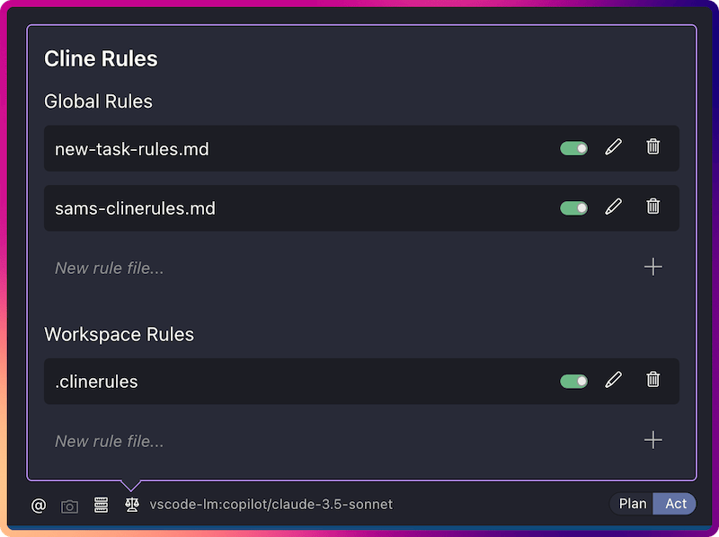

# Sam's Agentic Coding Rules, Templates and Examples

- [Sam's Agentic Coding Rules, Templates and Examples](#sams-agentic-coding-rules-templates-and-examples)
  - [MCP Servers](#mcp-servers)
  - [Rules](#rules)
  - [Links](#links)
  - [License](#license)

A collection of coding rules, templates, MCP servers and examples for working with Agentic Coding tools (Cline, Github Copilot etc...)

---

## MCP Servers

- [MVP / Always On](./MCP/mcp-config-mvp.json)
  - [Context7](https://github.com/upstash/context7): Used to fetch documentation.
  - [Fetch](https://github.com/modelcontextprotocol/servers/blob/main/src/fetch/README.md): Used to fetch URLs.
  - [Brave Search](https://github.com/modelcontextprotocol/servers/tree/main/src/brave-search): Provides web search (free Brave Search AI API key required).
  - [Package Version](https://github.com/sammcj/mcp-package-version): Used to get up to date package versions.
  - [Github](https://github.com/modelcontextprotocol/servers/blob/main/src/github/README.md): Used to fetch information from GitHub repositories, Github Issues & PRs.
- [Sometimes Used](./MCP/mcp-config-sometimes.json)
  - [Firecrawl](https://github.com/mendableai/firecrawl-mcp-server): Provides web scraping and markdown conversion (Self hosted Firecrawl, or Firecrawl API key required).
  - [Markdownify](github.com/zcaceres/markdownify-mcp): Converts documents to markdown.
  - [Browser Use](https://github.com/Saik0s/mcp-browser-use): Gives access to a browser.
  - [SearXNG](https://github.com/ihor-sokoliuk/mcp-searxng): Provides web search (Self hosted SearXNG required).
  - [Magic MCP](https://github.com/21st-dev/magic-mcp): Provides frontend UI components.

---

## Rules

### Cline

- [Cline Rules](./Cline/Rules/)

#### [sams-clinerules.md](./Cline/Rules/sams-clinerules.md)

- My global clinerules.
- Always enabled across different projects.

#### [new-task-rules.md](./Cline/Rules/new-task-rules.md)

- Implements Cline's ['new task tool'](https://docs.cline.bot/exploring-clines-tools/new-task-tool).
- Always enabled across different projects.

#### [cline-memory-bank.md](./Cline/Rules/cline-memory-bank.md)

- Copy of https://docs.cline.bot/improving-your-prompting-skills/cline-memory-bank

#### [Repo Specific Rules](./Cline/repo-specific-rules/)

- [mcp-server-development-rules.md](./Cline/repo-specific-rules/mcp-server-development-rules.md)
  - Assists when developing new MCP servers.
  - Modified version of https://docs.cline.bot/mcp-servers/mcp-server-from-scratch.
- [mcp-server-repo-example.md](./Cline/repo-specific-rules/mcp-server-repo-example.md)
  - Assists with working on existing MCP servers.

---

## Links

- [Blog - smcleod.net](https://smcleod.net)
- [GitHub - sammcj](https://github.com/sammcj)

## License

- This repository is licensed under the [Apache 2.0 License](./LICENSE).
