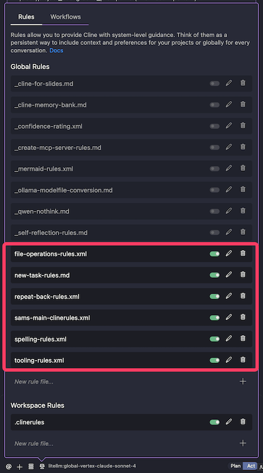

# Sam's Agentic Coding Rules, Templates and Examples

- [Sam's Agentic Coding Rules, Templates and Examples](#sams-agentic-coding-rules-templates-and-examples)
  - [MCP Servers](#mcp-servers)
  - [Coding Agent Rules](#coding-agent-rules)
  - [Patterns / Workflows](#patterns--workflows)
  - [Links](#links)
  - [License](#license)

A collection of coding rules, templates, MCP servers and examples for working with Agentic Coding tools (Cline, Claude Code etc...)

## MCP Servers

- [MCP DevTools](https://github.com/sammcj/mcp-devtools): This has become the only MCP server I _always_ have enabled. I wrote it to provide the most common tooling I use with Agentic Coding.
  - [Example MCP DevTools client config](https://github.com/sammcj/agentic-coding/blob/main/MCP/mcp-config-mvp.json)

## Coding Agent Rules

I tend to try and write most of my rules in pseudo-XML format as some LLMs (such as Anthropic Claude) are specifically trained on XML which can result in better results and prompt adherence.

Note: **Do not blindly import and enable all my (or anyone else's) rules!**

Only enable the rules you want, if you enable all of my (or anyone else's) rules you'll be reducing the signal to noise ratio and adding to the token count. Remember - LLMs are stateless, every interaction with them means sending the entire context.

- Rules starting with an `_` indicate that I only toggle these on for specific scenarios and they are disabled by default.
- I often add a project specific rules file to the root of the repository, such as `.clinerules`, `CLAUDE.md` or similar. I have an _example_ of what these might look like in [Cline/Rules/adhoc/_repo-specific-rules.md](./Cline/Rules/adhoc/_repo-specific-rules.md).

- [Agent Rules](./Cline/Rules/) - Note that while these are mainly written for use with Cline, for 95% of them there's no reason they can't be used with other Agentic Coding tools such as Claude Code etc. without modification.
- [Workflows (Prompt Templates)](./Cline/Workflows/)
- [Amazon Kiro Specific Rules](./Kiro/kiro-specific-rules.md) (Mainly as Kiro seems to over-complicate and over-engineer everything).
- [Cline Docs on Rules](https://docs.cline.bot/features/cline-rules)

## Patterns / Workflows

- See my blog post on my Setup -> Plan -> Act -> Review & Iterate workflow at: [smcleod.net](https://smcleod.net)

## Links

- [Blog - smcleod.net](https://smcleod.net)
- [GitHub - sammcj](https://github.com/sammcj)
- [Cline](https://cline.bot): IMO The best agentic coding tool.

## License

- This repository is licensed under the [Apache 2.0 License](./LICENSE).
