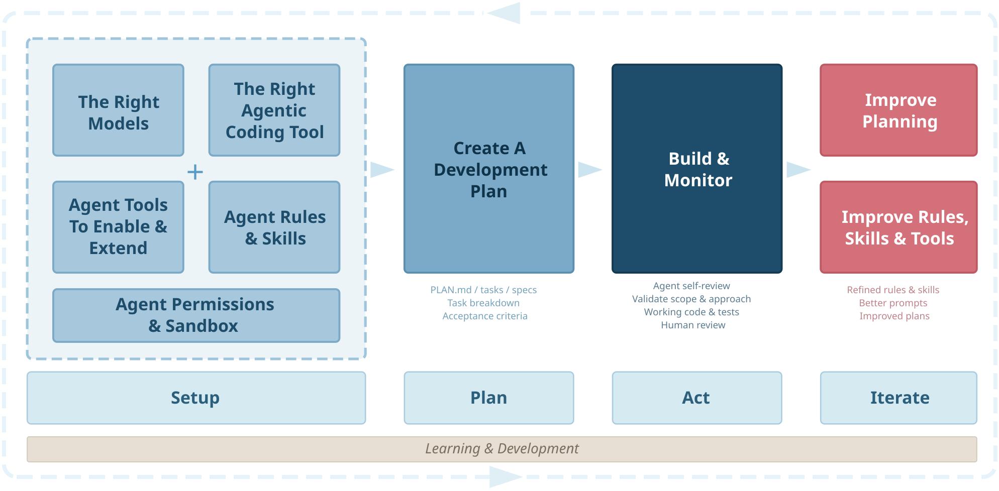

# Sam's Agentic Coding Rules, Templates and Examples

- [Coding Agent Rules, Skills and Templates](#coding-agent-rules-skills-and-templates)
- [Tips For Agentic Coding](#tips-for-agentic-coding)
  - [Recommended 3rd Party Plugins and Tools](#recommended-3rd-party-plugins-and-tools)
  - [Getting High Quality Outcomes \& Context Engineering](#getting-high-quality-outcomes--context-engineering)
  - [Subscription vs Consumption Based Providers](#subscription-vs-consumption-based-providers)
- [Links](#links)
- [License](#license)

My Agent Skills, Agent Rules for Agentic Coding.

## Coding Agent Rules, Skills and Templates

The repository is organised with tool-agnostic content at the root level:

- [Agent Skills](./Skills/) - Composable skills that extend agent capabilities
- [Custom Agents](./Claude/agents/) - Custom defined agents (use sparingly).
- [Agent Rules](./Rules/) - Agent instruction files
  - [Rules/CLAUDE.md](./Rules/CLAUDE.md) is usually the most up to date and comprehensive
- [Agent Commands](./Claude/commands/) - (Prompt templates)
- [Claude Local Marketplace](./Claude/plugins/local-marketplace/) - My local marketplace (plugins) for Claude Code, including LSP definitions.

Most skills and rules are reasonably portable between agentic coding tools.

---

## Tips For Agentic Coding

- Lean into [skills](https://github.com/sammcj/agentic-coding/tree/main/Skills), dynamical context acquisition is very powerful.
  - Read my [best practices and common pitfalls when writing and reviewing agent skills](https://smcleod.net/2026/07/writing-and-reviewing-agent-skills-common-pitfalls/).
  - If Claude gets stuck on a complex issue, get it to stop and perform a systematic debug of the issue using the systematic-debugging skill.
- Setup your permissions (in settings.json) to pre-approve/deny/ask commands and file paths that Claude may want to use.
- Always enable sandboxing for agent commands, ideally run your whole agent in a sandbox when it is practical to do so.
- Encourage Claude to use sub-agents to parallelise work and keep context lean where it is safe to do so.
- Using voice to text with a tool like [Handy](https://handy.computer/) to dictate work to Claude Code is incredibly useful, often with voice you capture intent that you'd otherwise edit out.
- Create shell aliases for the various claude CLI commands you use, e.g. `alias cc='claude --continue`, `alias ccr='claude --resume` etc.
- Add your context usage, and limits consumption to the statusline.
- Only add rules (CLAUDE.md / AGENTS.md) for behaviour that is different from standard for the agent/model, keep them concise and review with an aim to reduce over time.Only enable the rules you actually want to use**
- Don't waste time with low end models for planning or coding, the higher error rates, lower quality code and the rework they often incur does not pay off (at least with current generation models).

### Recommended 3rd Party Plugins and Tools

- [cc-safety-net](https://ccsafetynet.com/) (hooks that try to catch some destructive commands).
- [context-mode](https://github.com/mksglu/context-mode) which significantly reduces context usage.
- [Graphify](https://github.com/Graphify-Labs/graphify) can be useful for creating graphs of code and LLM wikis providing them with semantic search and context.

Note: I do _not_ recommend using MCP tools like Github's where the agent is more than capable of using the gh cli or API directly, they tend to just waste tokens and bloat the context.

---

### Getting High Quality Outcomes & Context Engineering

- Start with a plan - break down large or complex tasks into a checklist of items to complete, have the agent follow and mark off items has it completes them.
- Relentlessly start fresh sessions, aim to keep the context under 200k - 300k max.
  - When you want to refresh the conversation ask the agent to document where it is up to and what's left to do (if you don't already have a dev plan with a checklist of tasks) and provide the document when starting a fresh session.
- GIGO - Garbage In, Garbage Out. This aligns with the research that shows LLMs output correlates with the education level and quality of the input.
- Make the system self-improving: If you spend a long time on a difficult problem with a coding agent and you finally crack it - get it to: 1. Summarise the fix 2. Why previous attempts did not work 3. What led them down the wrong paths initially 4. Suggest how to improve the agentic coding experience to prevent this in the future.
- Understand that LLMs are stateless, this means that every time you send a message the entire context is sent back for re-processing.
- Don't fall into the trap of thinking the solution is just around the corner when you've dug yourself into a hole troubleshooting, get the agent to document the problem, what it's tried to fix it so far and possible next things to try, then start a fresh session and provide the document.
- Use checkpoints to roll back to previous points in the conversation or code changes when you've gone down the wrong path or want to explore a different approach.
- Only use multimodal operations (images / screenshots as used by browser tools etc..) to a minimum - only when truly needed or where cost is not an issue as they use a lot of tokens.
- Add files and directories you never want the agent to read to the agent's ignore file (e.g. `.clineignore` or claude.json's access rules).
- Don't pipe data into LLMs and be wary of code with hardcoded data (XML, SVGs, i18n translations) inline. LLMs are designed to perform predictions (e.g. writing text / code and answering questions) effectively, they're not designed to parse large amounts of data at low cost - that's what software is for.

---

### Subscription vs Consumption Based Providers

- A Claude Max 5 subscription will cost you $100 USD / month and get you over $1500+ equivalent worth of raw LLM API token usage, Max 20 gets you $2000-$5000~ worth.
- Be wary of second tier subscription based AI coding tools, especially if they're built around an IDE like Cursor or Windsurf - they often provide you reduced versions of models with smaller context windows, artificially slowed response times and fallback to lower end models. Read the fine print especially if it seems too cheap to be true.
- Some consumption based offerings like Github Copilot have very low rate limits if you use the service with anything other than their client. With Github Copilot's SDK you can use your entire months paid limits of Claude Sonnet access in just two days.

---

## Links

- [Blog - smcleod.net](https://smcleod.net)
- [GitHub - sammcj](https://github.com/sammcj)
- [Claude Code](https://claude.com/product/claude-code)
- [OpenCode](https://opencode.ai)
- [Cline](https://cline.bot)

## License

- This repository is licensed under the [Apache 2.0 License](./LICENSE).
