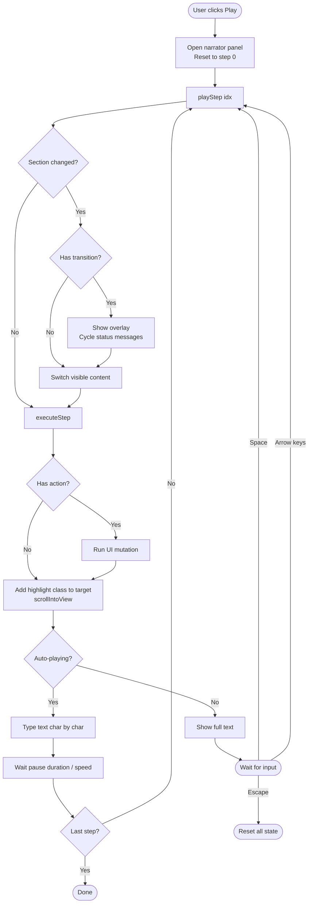

# Implementation Reference

Copy-paste example code snippets for implementing the guided demo pattern. Adapt colours, selectors, timing etc. to suit the application.

## Narrator panel

```html
<div id="demoPanel" class="demo-panel">
  <div class="demo-progress"><div id="progressFill" class="demo-progress-fill"></div></div>
  <div style="padding:16px 24px;">
    <div id="narrator" class="demo-narrator"></div>
  </div>
  <div class="demo-controls">
    <button onclick="stepBack()">&laquo;</button>
    <button id="playBtn" onclick="togglePlayback()">&#9654;</button>
    <button onclick="stepForward()">&raquo;</button>
    <span style="margin-left:12px;font-size:12px;opacity:0.6;">
      <button onclick="setSpeed(0.5)" style="background:none;border:none;color:inherit;cursor:pointer;opacity:0.6;font-size:11px;">0.5x</button>
      <button onclick="setSpeed(1)" style="background:none;border:none;color:inherit;cursor:pointer;font-size:11px;">1x</button>
      <button onclick="setSpeed(2)" style="background:none;border:none;color:inherit;cursor:pointer;opacity:0.6;font-size:11px;">2x</button>
    </span>
    <span style="margin-left:auto;font-size:12px;opacity:0.6;" id="demoCounter">1 / 10</span>
  </div>
</div>
```

```css
.demo-panel {
  position: fixed; bottom: 0; left: 0; right: 0;
  z-index: 500;
  background: #1a1a2e; color: white;
  transform: translateY(100%);
  transition: transform .35s cubic-bezier(.4,0,.2,1);
  display: flex; flex-direction: column;
}
.demo-panel.open { transform: translateY(0); }
.demo-narrator {
  font-size: 18px; line-height: 1.65;
  color: rgba(255,255,255,0.9); min-height: 48px;
}
.demo-narrator .typing-cursor {
  display: inline;
  animation: blink .7s infinite;
  color: #4fc3f7;
}
@keyframes blink { 50% { opacity: 0; } }
.demo-progress { height: 3px; background: rgba(255,255,255,0.1); }
.demo-progress-fill { height: 100%; background: #4fc3f7; transition: width .3s ease; }
.demo-controls {
  display: flex; align-items: center; gap: 8px;
  padding: 6px 24px 14px;
  border-top: 1px solid rgba(255,255,255,0.1);
}
.demo-controls button {
  background: rgba(255,255,255,0.1); border: none;
  color: white; padding: 4px 12px; border-radius: 4px;
  cursor: pointer; font-size: 14px;
}
.demo-controls button:hover { background: rgba(255,255,255,0.2); }
```

Adapt: background colour to match the application's branding. The `#4fc3f7` accent works on dark backgrounds; swap for the app's accent colour.

---

## Highlight class

```css
.demo-highlight {
  outline: 2px solid #4fc3f7 !important;
  outline-offset: 4px;
  border-radius: 6px;
  animation: demoGlow 2s ease-in-out infinite;
  position: relative;
  z-index: 2;
}
@keyframes demoGlow {
  0%, 100% { box-shadow: 0 0 0 0 rgba(79,195,247,0); outline-color: #4fc3f7; }
  50% { box-shadow: 0 0 16px 4px rgba(79,195,247,0.15); outline-color: rgba(79,195,247,0.7); }
}
```

Why `outline` not `border`: outline does not affect the element's box model, so adding or removing the highlight does not cause layout shift.

---

## Typewriter function

```javascript
let typeTimer = null;
const TYPE_SPEED = 5;  // ms per character at 1x
const PAUSE_MS = 3000; // ms pause between steps at 1x
let playbackSpeed = 1;

function typeText(text, element, onComplete) {
  element.innerHTML = '';
  let i = 0;

  function tick() {
    if (i < text.length) {
      const span = document.createElement('span');
      span.textContent = text.substring(0, ++i);
      element.innerHTML = '';
      element.appendChild(span);
      const cursor = document.createElement('span');
      cursor.className = 'typing-cursor';
      cursor.textContent = '|';
      element.appendChild(cursor);
      typeTimer = setTimeout(tick, TYPE_SPEED / playbackSpeed);
    } else {
      element.textContent = text;
      if (onComplete) onComplete();
    }
  }

  tick();
}
```

Uses `textContent` (not `innerHTML`) for the narration text to prevent injection. The `innerHTML = ''` clearing is intentional and safe (no user content). The timer reference is stored so it can be cancelled on pause, step, or stop.

```javascript
function setSpeed(s) {
  playbackSpeed = s;
  document.querySelectorAll('.demo-controls span button').forEach(btn => {
    btn.style.opacity = parseFloat(btn.textContent) === s ? '1' : '0.6';
  });
}
```

---

## Playback loop

```javascript
let isActive = false;
let isPlaying = false;
let currentStep = 0;
let currentSection = 0;
let pauseTimer = null;
let currentHighlight = null;

function startDemo() {
  if (isActive) return;
  isActive = true;
  isPlaying = true;
  currentStep = 0;
  document.getElementById('demoPanel').classList.add('open');
  updatePlayButton();
  // Navigate to first section
  switchSection(0);
  playStep(0);
}

function playStep(idx) {
  currentStep = idx;
  const step = DEMO_SCRIPT[idx];
  updateProgress();

  // Section change
  if (step.section !== currentSection) {
    if (step.transition) {
      showInterstitial(step.section, () => {
        switchSection(step.section);
        executeStep(step);
      });
      return;
    }
    switchSection(step.section);
  }

  executeStep(step);
}

function executeStep(step) {
  // Run action before highlighting
  if (step.action) {
    executeAction(step.action, step.actionTarget);
  }

  // Highlight target
  clearHighlight();
  if (step.target) {
    const el = document.querySelector(step.target);
    if (el) {
      el.classList.add('demo-highlight');
      currentHighlight = el;
      el.scrollIntoView({ behavior: 'smooth', block: 'center' });
    }
  }

  // Narrate
  const narrator = document.getElementById('narrator');
  const onDone = () => {
    if (isPlaying && currentStep < DEMO_SCRIPT.length - 1) {
      pauseTimer = setTimeout(() => {
        if (isPlaying) playStep(currentStep + 1);
      }, PAUSE_MS / playbackSpeed);
    }
  };

  if (isPlaying) {
    typeText(step.text, narrator, onDone);
  } else {
    narrator.textContent = step.text;
  }
}

function switchSection(idx) {
  currentSection = idx;
  // Replace this with your app's navigation logic:
  // e.g. show/hide tab panels, call router.push(), set slide index
  document.querySelectorAll('.section').forEach((s, i) => {
    s.style.display = i === idx ? 'block' : 'none';
  });
}
```

The `switchSection()` function is the main integration point. Replace its body with whatever navigation the application uses (tab switching, route changes, scroll-to-section, slide index).

---

## Transition interstitials

```html
<div class="demo-interstitial" id="demoInterstitial">
  <div class="demo-interstitial-text" id="interstitialText">Processing...</div>
</div>
```

```css
.demo-interstitial {
  position: fixed; inset: 0; z-index: 490;
  background: rgba(0,0,0,0.85);
  display: flex; align-items: center; justify-content: center;
  flex-direction: column; gap: 16px;
  opacity: 0; visibility: hidden;
  transition: opacity .3s, visibility .3s;
}
.demo-interstitial.visible { opacity: 1; visibility: visible; }
.demo-interstitial-text {
  font-size: 15px; color: rgba(255,255,255,0.7);
  font-weight: 500; letter-spacing: .01em;
}
```

```javascript
function showInterstitial(sectionIdx, onComplete) {
  const overlay = document.getElementById('demoInterstitial');
  const textEl = document.getElementById('interstitialText');

  // Define messages per section
  const messages = [
    [],
    ['Analysing data...', 'Running calculations...'],
    ['Generating recommendations...', 'Scoring confidence...'],
    ['Preparing summary...', 'Compiling results...']
  ];
  const msgs = messages[sectionIdx] || ['Processing...'];

  overlay.classList.add('visible');
  let i = 0;

  function next() {
    if (i < msgs.length) {
      textEl.textContent = msgs[i++];
      setTimeout(next, 1200);
    } else {
      overlay.classList.remove('visible');
      onComplete();
    }
  }
  next();
}
```

Adapt: interstitial messages should reflect what the application is "doing" between sections. Brand the overlay with a logo or icon if appropriate.

---

## Step actions

```javascript
function executeAction(action, target) {
  if (action === 'expand') {
    document.getElementById(target).classList.add('open');
  }
  if (action === 'collapse') {
    document.getElementById(target).classList.remove('open');
  }
  if (action === 'collapseAll') {
    document.querySelectorAll('.' + target + '.open').forEach(el => el.classList.remove('open'));
  }
  if (action === 'click') {
    document.getElementById(target).click();
  }
  if (action === 'expandOne') {
    // Accordion: close all siblings, open target
    document.querySelectorAll('.' + target.split(':')[0] + '.open').forEach(el => el.classList.remove('open'));
    document.getElementById(target.split(':')[1]).classList.add('open');
  }
  if (action === 'call') {
    // Trigger a named function, e.g. actionTarget: 'requestBriefing'
    if (typeof window[target] === 'function') window[target]();
  }
  if (action === 'addClass') {
    document.body.classList.add(target);
  }
  if (action === 'removeClass') {
    document.body.classList.remove(target);
  }
  // Add more as needed - one if block per action type
}
```

Actions run before highlighting because the target element might be inside a collapsed panel. The panel must be open before `querySelector` can find and scroll to the element.

---

## Keyboard controls

```javascript
document.addEventListener('keydown', (e) => {
  if (!isActive) return;

  // Don't capture keys when user is interacting with form elements
  const tag = e.target.tagName;
  if (tag === 'INPUT' || tag === 'TEXTAREA' || tag === 'SELECT') return;

  if (e.code === 'Space') {
    e.preventDefault();
    togglePlayback();
  } else if (e.code === 'ArrowRight') {
    stepForward();
  } else if (e.code === 'ArrowLeft') {
    stepBack();
  } else if (e.code === 'KeyM') {
    toggleTTS();
  } else if (e.code === 'Escape') {
    stopDemo();
  }
});

function togglePlayback() {
  if (isPlaying) {
    isPlaying = false;
    clearTimeout(typeTimer);
    clearTimeout(pauseTimer);
  } else {
    isPlaying = true;
    playStep(currentStep);
  }
  updatePlayButton();
}

function stepForward() {
  clearTimeout(typeTimer);
  clearTimeout(pauseTimer);
  isPlaying = false;
  updatePlayButton();
  if (currentStep < DEMO_SCRIPT.length - 1) playStep(currentStep + 1);
}

function stepBack() {
  clearTimeout(typeTimer);
  clearTimeout(pauseTimer);
  isPlaying = false;
  updatePlayButton();
  if (currentStep > 0) playStep(currentStep - 1);
}

function updatePlayButton() {
  document.getElementById('playBtn').innerHTML = isPlaying ? '&#9646;&#9646;' : '&#9654;';
}
```

The `isActive` gate prevents keyboard capture when the demo is not running.

---

## Progress bar

```javascript
function updateProgress() {
  const pct = ((currentStep + 1) / DEMO_SCRIPT.length * 100);
  document.getElementById('progressFill').style.width = pct + '%';
  document.getElementById('demoCounter').textContent =
    (currentStep + 1) + ' / ' + DEMO_SCRIPT.length;
}
```

---

## Step countdown indicator

A thin bar that fills during the pause between steps, showing time until auto-advance. Uses CSS animation driven by a dynamically set `animation-duration`, not JS intervals.

### Markup

Add this directly below the step progress bar, above the narrator text:

```html
<div class="demo-step-countdown">
  <div id="countdownFill" class="demo-step-countdown-fill"></div>
</div>
```

The container is always rendered (prevents layout shift). The fill element is shown/hidden by adding/removing a class that triggers the animation.

### CSS

```css
.demo-step-countdown {
  height: 2px;
  background: rgba(255, 255, 255, 0.06);
}

.demo-step-countdown-fill {
  height: 100%;
  width: 0%;
  background: rgba(79, 195, 247, 0.7);  /* use the app's accent colour */
}

.demo-step-countdown-fill.running {
  animation: demoCountdown linear forwards;
}

@keyframes demoCountdown {
  from { width: 0%; }
  to { width: 100%; }
}
```

Use `linear` timing, not `ease`. The viewer reads it as a countdown and easing makes the remaining time harder to judge. The fill colour should be the application's accent colour at 0.6-0.8 opacity.

### Starting the countdown

In the `onDone` callback (fired when typewriter text finishes), before setting the pause timer. The approach: remove and re-add the fill element to reset the CSS animation cleanly.

```javascript
function startCountdown(durationMs) {
  const container = document.getElementById('countdownFill');
  // Clone and replace to reset CSS animation
  const fresh = container.cloneNode(false);
  container.parentNode.replaceChild(fresh, container);
  fresh.id = 'countdownFill';
  fresh.style.animationDuration = durationMs + 'ms';
  fresh.classList.add('running');
}

function clearCountdown() {
  const fill = document.getElementById('countdownFill');
  if (fill) {
    fill.classList.remove('running');
    fill.style.width = '0%';
  }
}
```

In vanilla JS (no React mount/unmount), replacing the DOM node with a clone is the cleanest way to restart a CSS animation from 0%. The alternative (`animation: none; void el.offsetHeight; animation: ...`) is a reflow hack that is less reliable.

### Integration with executeStep

Update the `onDone` callback to start the countdown alongside the pause timer:

```javascript
const onDone = () => {
  if (isPlaying && currentStep < DEMO_SCRIPT.length - 1) {
    const adjustedPause = (step.delay ?? PAUSE_MS) / playbackSpeed;
    startCountdown(adjustedPause);
    pauseTimer = setTimeout(() => {
      if (isPlaying) playStep(currentStep + 1);
    }, adjustedPause);
  }
};
```

The countdown only starts when there is a next step to advance to. No countdown on the last step.

### Cleanup

Add `clearCountdown()` inside `clearAllTimers()`. This single site handles all reset scenarios (stepping, pausing, stopping, exiting) because every interrupting action calls `clearAllTimers()` first:

```javascript
function clearAllTimers() {
  clearTimeout(typeTimer);
  clearTimeout(pauseTimer);
  clearCountdown();
  if ('speechSynthesis' in window) speechSynthesis.cancel();
}
```

---

## Cleanup

```javascript
function stopDemo() {
  isActive = false;
  isPlaying = false;
  clearTimeout(typeTimer);
  clearTimeout(pauseTimer);
  document.getElementById('demoPanel').classList.remove('open');
  clearHighlight();
  document.getElementById('narrator').textContent = '';
  // Reset any UI state modified by actions during the demo
  document.querySelectorAll('.open').forEach(el => {
    // Only close elements that the demo opened - scope this selector
    // to your app's collapsible class names
  });
}

function clearHighlight() {
  if (currentHighlight) {
    currentHighlight.classList.remove('demo-highlight');
    currentHighlight = null;
  }
  document.querySelectorAll('.demo-highlight').forEach(el =>
    el.classList.remove('demo-highlight')
  );
}
```

Cleanup must reset every piece of state the demo touched. Scope the `.open` cleanup to the application's specific collapsible classes to avoid accidentally closing unrelated UI.

---

## Flow diagram



---

## Text-to-speech narration

TTS uses the browser's `speechSynthesis` Web Speech API. Off by default. The user activates it via a speaker icon in the control bar.

### Control bar toggle

Add a mute/unmute button to the narrator panel controls, between the step buttons and speed controls:

```html
<button id="ttsBtn" onclick="toggleTTS()" title="Toggle narration (M)" style="opacity:0.4;">
  &#128264;
</button>
```

The button uses a speaker character entity. Dimmed (`opacity: 0.4`) when muted (default), full opacity when active.

### Voice selection

Voices load asynchronously in some browsers. Listen for the `voiceschanged` event and cache the selected voice.

```javascript
let selectedVoice = null;
let isMuted = true;

function initVoices() {
  if (!('speechSynthesis' in window)) return;
  const voices = speechSynthesis.getVoices();
  if (!voices.length) return;

  // Preference cascade - adjust locale and voice names for target audience
  const cascades = [
    // 1. Specific high-quality voice by name and locale
    v => v.name.includes('Daniel') && v.lang === 'en-GB',
    // 2. Google voices for target locale
    v => v.name.includes('Google') && v.lang.startsWith('en-GB'),
    // 3. Any voice matching target locale, excluding novelty voices
    v => v.lang.startsWith('en-GB') && !/Grandma|Grandpa|Novelty|Bells/i.test(v.name),
    // 4. Fallback locales
    v => v.lang.startsWith('en-AU'),
    v => v.lang.startsWith('en'),
  ];

  for (const predicate of cascades) {
    const match = voices.find(predicate);
    if (match) { selectedVoice = match; return; }
  }
}

// Voices may not be available immediately
if ('speechSynthesis' in window) {
  speechSynthesis.addEventListener('voiceschanged', initVoices);
  initVoices();  // try immediately in case they're already loaded
}
```

Adapt the preference cascade to the project's target audience locale. The example above prefers British English, falling back through Australian English to any English voice.

### speakText function

Called at the start of every step. Cancels any in-progress utterance before speaking.

```javascript
function speakText(text) {
  if (!('speechSynthesis' in window)) return;
  speechSynthesis.cancel();  // cut off previous utterance
  if (isMuted) return;

  const utterance = new SpeechSynthesisUtterance(text);
  utterance.rate = playbackSpeed;
  if (selectedVoice) utterance.voice = selectedVoice;
  speechSynthesis.speak(utterance);
}
```

### Integration with executeStep

Add a single `speakText(step.text)` call in `executeStep()`, after highlighting and before the typewriter/instant-text branch. One call site, not two:

```javascript
  // ... after clearHighlight and scrollIntoView ...

  // TTS: speak before typewriter starts
  speakText(step.text);

  // ... then typewriter or instant text as before ...
```

This placement ensures TTS fires for both auto-play and paused/manual-step code paths.

### Toggle and keyboard shortcut

```javascript
function toggleTTS() {
  isMuted = !isMuted;
  document.getElementById('ttsBtn').style.opacity = isMuted ? '0.4' : '1';
  if (isMuted && 'speechSynthesis' in window) {
    speechSynthesis.cancel();
  }
}
```

The `M` shortcut is already included in the keyboard handler (see Keyboard controls section).

### Cancellation sites

`speechSynthesis.cancel()` must appear in every cleanup path. Missing any one of these causes the previous utterance to play over the new step's narration:

```javascript
function stopDemo() {
  isActive = false;
  isPlaying = false;
  clearTimeout(typeTimer);
  clearTimeout(pauseTimer);
  if ('speechSynthesis' in window) speechSynthesis.cancel();
  // ... rest of cleanup
}

// Also add to clearAllTimers if you have a consolidated timer-clearing function:
function clearAllTimers() {
  clearTimeout(typeTimer);
  clearTimeout(pauseTimer);
  if ('speechSynthesis' in window) speechSynthesis.cancel();
}
```

---

## Print styles

```css
@media print {
  .demo-panel, .demo-interstitial { display: none !important; }
}
```

## Accessibility

```html
<div id="narrator" class="demo-narrator" role="status" aria-live="polite"></div>
```

Add `role="status"` and `aria-live="polite"` to the narrator element so screen readers announce the narration text as it changes.
