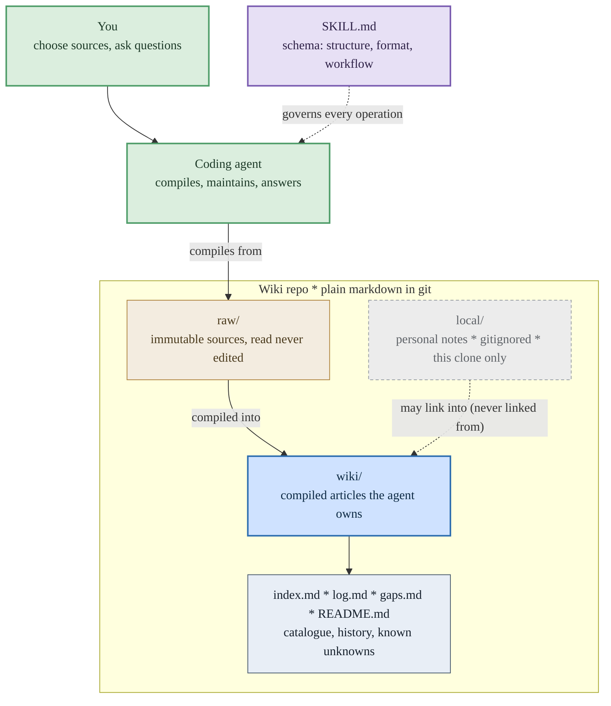
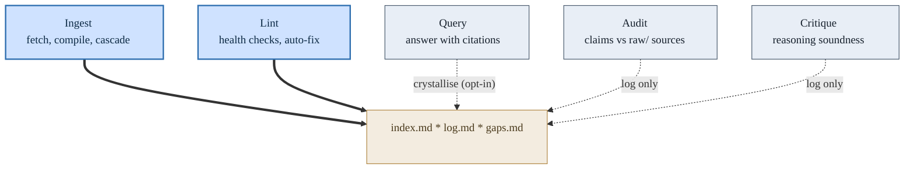
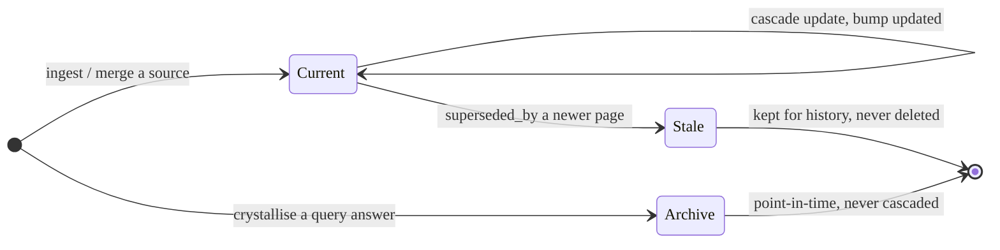

# LLM Wiki

A self-contained Agent Skill for building and maintaining a personal knowledge base in plain markdown. Your coding agent compiles sources into durable, cross-linked pages, answers questions from them with citations, and keeps the wiki healthy as it grows. No servers, no database, no embeddings. It opens as an Obsidian vault and reads cleanly on GitHub.

Based on [Karpathy's LLM Wiki idea](https://gist.github.com/karpathy/442a6bf555914893e9891c11519de94f), with a design that stays small on purpose.

## What an LLM wiki is

A knowledge system where the LLM maintains structured wiki pages instead of re-searching raw documents on every question. New sources are compiled into durable markdown pages, cross-references are kept current, and answers cite the pages that already hold the synthesised knowledge.

The split of work, from Karpathy: the LLM writes and maintains the wiki; you choose sources and ask questions.

| Operation  | What it does                                                          | Output                                                |
| ---------- | --------------------------------------------------------------------- | ----------------------------------------------------- |
| **Ingest** | Filters and stores a source in `raw/`, then compiles it into the wiki | New or updated pages                                  |
| **Query**  | Reads the index, follows links, answers with citations                | Grounded answers; optionally filed back as a page     |
| **Lint**   | Checks index, links, frontmatter, and health                          | Auto-fixes the deterministic issues, reports the rest |

See [SKILL.md](SKILL.md) for the full specification.

## Why not just RAG

|                    | RAG                                | LLM wiki                                              |
| ------------------ | ---------------------------------- | ----------------------------------------------------- |
| Knowledge lives in | Raw chunks and embeddings          | Curated markdown pages                                |
| Synthesis happens  | At query time, every time          | Once, at ingest, then kept current                    |
| Good for           | Broad retrieval over large corpora | Compounding knowledge, summaries, durable cross-links |

RAG retrieves and re-derives on every question. A wiki accumulates: the cross-references are already there, contradictions are already flagged, and the synthesis reflects everything you have read.

## Architecture

Three layers under one project root, all plain markdown in git. `raw/` is the immutable source of truth the agent reads but never edits. `wiki/` is the compiled knowledge the agent owns. `SKILL.md` is the schema layer that governs every operation, and an optional `local/` sibling holds private notes kept out of git.



## How it works

### Ingest: fetch, then compile

Ingest is always two steps. A source is fetched, filtered for secrets, and landed in `raw/` as durable markdown; then it is compiled into `wiki/`, either merged into an existing article or written as a new one. Compiling ripples outward: related articles are updated, outdated ones superseded, and the catalogue, log, and gap register are kept in step.

```mermaid
%%{init: {'flowchart': {'curve': 'basis'}, 'themeVariables': {'fontFamily': 'ui-sans-serif, system-ui, sans-serif'}}}%%
flowchart LR
    src["Source<br/>URL * file * paste"]:::ext
    mode{"Keep verbatim<br/>or distil?"}:::decision
    fetch["Fetch + filter<br/>strip secrets & PII"]:::step
    rawf["raw/topic/<br/>YYYY-MM-DD-slug.md"]:::raw
    compile["Compile<br/>merge into article<br/>or create new"]:::step
    art["wiki/topic/article.md"]:::wiki
    cascade["Cascade<br/>update affected articles,<br/>supersede the outdated"]:::step
    book["Update index.md * log.md,<br/>gaps.md if the frontier moved"]:::special

    src --> mode --> fetch --> rawf --> compile --> art --> cascade --> book

    classDef ext      fill:#f4f4f2,stroke:#b9bdc4,stroke-dasharray:2 2,color:#444b54;
    classDef decision fill:#fff5d6,stroke:#c8a52a,color:#5a4a12;
    classDef step     fill:#e8eef6,stroke:#4a5b6e,color:#16202c;
    classDef raw      fill:#f3ece0,stroke:#b08642,color:#4a3a1c;
    classDef wiki     fill:#cfe2ff,stroke:#2f6fb0,stroke-width:2px,color:#0d2a44;
    classDef special  fill:#e8eef6,stroke:#4a5b6e,color:#16202c;
```



### What each operation touches

Five operations, with Query as the default. Only Ingest and Lint write to the wiki by design. Query, Audit, and Critique are read-mostly: they answer or report, and touch the wiki only at the log, or as an opt-in when you ask to keep a result.



### The article lifecycle

Knowledge is replaced by supersession, never deletion. A current article is updated in place as related sources arrive; when a newer source clearly replaces it, it is marked stale and linked to its replacement, and kept so the history still explains why the current state exists. Crystallised query answers are filed as point-in-time archives that are never cascade-updated.



## Design principles

These are the opinions that keep the wiki useful as it grows, and keep it free of infrastructure. They draw on the [community "v2" discussion](https://gist.github.com/rohitg00/2067ab416f7bbe447c1977edaaa681e2) and its comments, taking the parts that hold up and dropping the rest.

- **Self-contained.** Plain markdown, relative links, YAML frontmatter. It uses tools you already have (grep, git) and nothing you have to stand up.
- **Supersession, not decay.** Outdated knowledge is marked stale and linked to its replacement, never deleted on a timer. An old bug or a superseded decision still explains why the current state exists.
- **Evidence, not confidence scores.** A claim carries the support behind it (which sources confirm, which contradict, when last confirmed), not an unverifiable number like `0.85`.
- **Filter at ingest.** Secrets and noise are stripped when a source arrives, so the wiki stays clean without a cleanup pass later.
- **Git is the audit trail.** History and rollback come from version control, not bespoke versioning fields.
- **Human in the loop.** It acts when you ask. It does not write to the wiki on background automation, because an unreviewed LLM corrupts a knowledge base quietly.

### What it deliberately leaves out

Embedding or vector search, knowledge-graph databases, numeric confidence scores, automatic forgetting curves, autonomous background writes, and multi-agent sync. Each one either needs infrastructure the personal scale does not justify, or adds precision the model cannot actually back up. The index plus grep handles retrieval into the hundreds of pages; past that, you have outgrown this skill.

## Install

This is a standard [Agent Skills](https://agentskills.io) skill: a folder with a `SKILL.md` and a `references/` directory. Copy it into your tool's skills directory.

Claude Code, available everywhere:

```bash
cp -r llm-wiki ~/.claude/skills/llm-wiki
```

Claude Code, single project:

```bash
cp -r llm-wiki .claude/skills/llm-wiki
```

Other tools: copy `SKILL.md` and `references/` into the tool's skill directory (for example `.agents/skills/llm-wiki/` for Codex). The published home is the [sammcj/agentic-coding](https://github.com/sammcj/agentic-coding) repo.

## Quick start

Ingest a source:

> "Ingest this article: https://example.com/attention-is-all-you-need"

It strips any secrets, stores the source in `raw/`, then compiles or updates the right pages in `wiki/`.

Ask the wiki:

> "What do I know about attention mechanisms?"

It reads the index, follows links and backlinks, and answers with citations. Say "save that to the wiki" and the answer is filed as an archive page so the exploration compounds like a source.

Keep it healthy:

> "Lint my wiki"

Auto-fixes index drift, broken links, and frontmatter gaps; reports contradictions, orphans, superseded claims, and knowledge gaps (concepts the wiki references but has not yet written).

## Layout

```text
your-project/
├── SKILL.md            ← Optional: load the wiki as a query-only Agent Skill
├── raw/                ← Immutable sources (frontmatter + original text), never edited
│   └── topic/
│       └── 2026-04-03-source-article.md
├── wiki/               ← Compiled pages the LLM maintains (frontmatter + markdown)
│   ├── index.md        ← Catalogue and query entry point
│   ├── log.md          ← Append-only operation log
│   ├── gaps.md         ← Register of known unknowns: wanted pages and open questions
│   └── topic/
│       ├── concept.md          ← status: current
│       └── old-concept.md      ← status: stale, superseded_by a newer page
└── local/              ← Optional: personal notes, gitignored, this clone only
```

`local/` is excluded from git so you can keep meeting prep, drafts, and private notes alongside the wiki without committing them. It may link into `wiki/`, but nothing committed links back into it, so the shared wiki stays self-contained for everyone else. See the llm-wiki skill's `references/local-content.md`.

A worked example lives in [examples/](examples/): two raw sources, the articles they compile to, a supersession pair, a crystallised query, a gap register, and the matching index and log.

## Using it with Obsidian

The wiki is a folder of markdown, so it opens directly as an Obsidian vault. Frontmatter shows up as Properties, body links populate the graph view and backlinks panel, and the Dataview plugin can query frontmatter if you want it. None of that is required: the hand-maintained `index.md` is canonical and the skill works with no plugins.

## Relationship to the Open Knowledge Format (OKF)

Take `wiki/` as the OKF bundle root. Inside it the format is a superset of an Open Knowledge Format (OKF) v0.1 bundle: every non-reserved file carries a non-empty `type` (articles, plus `README.md` and `gaps.md`); `index.md` and `log.md` are OKF's reserved filenames, following its index (§6) and update-log (§7) forms; cross-links are plain markdown links; and a `resource` field carries the same meaning. The practical payoff is portability of consumers. Any tool that reads OKF can read an llm-wiki with no export step, so the wiki inherits OKF's ecosystem - a static graph viewer, for instance - without this skill having to build or maintain one.

The wiki adds what OKF leaves out for a _maintained_ knowledge base rather than a static interchange format: the `raw/` provenance layer, supersession (`status` / `superseded_by`), the `gaps.md` frontier register, and evidence chains over numeric scores. An OKF consumer ignores those extra frontmatter keys, which its permissive conformance model requires it to tolerate. Compatibility runs one way on writes: maintenance still goes through this skill, since OKF specifies a format, not the ingest, supersession, and audit discipline that keeps the wiki sound.

## Credits

I've used something similar for years with agents / agentic coding tools, but it was popularised and in some ways formalised by [Karpathy](https://gist.github.com/karpathy/442a6bf555914893e9891c11519de94f). The design also learned from the [v2 gist](https://gist.github.com/rohitg00/2067ab416f7bbe447c1977edaaa681e2) and its comment thread, keeping the self-contained ideas (supersession, evidence chains, ingest-time filtering, crystallised answers) and leaving out the infrastructure-heavy ones. It began as a community Agent Skills implementation and has since been redesigned.

## License

[MIT](LICENSE)
