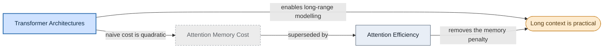

# Why Transformers Scale to Long Context

> Sources: [Transformer Architectures](transformer-architectures.md); [Attention Efficiency](attention-efficiency.md)
> Archived: 2026-04-06

## Question

If self-attention compares every position with every other, why are long context windows practical today?

## Findings

Two separate properties combine. First, the Transformer drops recurrence, so all positions are processed in parallel and any two positions sit at constant path length, which is what makes attention good at long-range dependencies in the first place ([Transformer Architectures](transformer-architectures.md)).

Second, the memory cost that once capped sequence length was an implementation artefact, not an algorithmic limit. IO-aware methods compute exact attention in linear memory by never materialising the full score matrix ([Attention Efficiency](attention-efficiency.md)). The earlier framing that the quadratic cost was a hard ceiling has been superseded.

So the short answer: attention gives the modelling benefit, and IO-aware kernels remove the memory penalty that used to make long context impractical.

## Map

Two paths converge on practical long context; the superseded view is shown dashed and grey. (Archive snapshot, 2026-04-06; see `../../../references/concept-map.md`.)

## Lessons

- A cost that looks algorithmic can turn out to be a systems problem; check where the data actually moves before treating a bound as fundamental.
- "Exact but cheaper" beats "approximate" when an implementation change can deliver it.

## See Also

- [Transformer Architectures](transformer-architectures.md)
- [Attention Efficiency](attention-efficiency.md)
