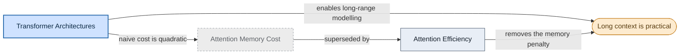

# Concept maps: agent-authored mermaid diagrams

A concept map is a small mermaid diagram that shows how a handful of ideas relate when prose conveys those relationships poorly. It is compiled content, authored the same way as an article and held to the same evidence standard: every edge is a claim you could defend in an audit. It is not decoration, and it is not a redraw of the link graph (Obsidian and `grep` already show what links to what). Its value is the thing a link graph cannot carry: the *kind* of relationship, named on the edge.

Default to prose. A map has to earn its place.

## When to draw, and when not

Draw a map only when the relationships are non-linear and a reader would struggle to hold them from text:

- branching or convergence (several things feed into or out of one),
- a cycle or feedback loop,
- a multi-step supersession or causal chain across several articles.

Do not draw a map when:

- there are two nodes, or a single linear `A -> B -> C` a sentence states better,
- it only restates the See Also list or the topic folder (the link graph already shows that),
- the edges would be unlabelled (an unlabelled edge means "links to", which adds nothing),
- it is purely linear - no node gains a second inbound or outbound edge - so it is a list, not a graph.

The test: if a sentence conveys it, or it only mirrors existing links, do not draw it. A map with no value is worse than no map - it costs maintenance and misleads when it drifts.

## What makes a good map

- **One theme, bounded.** Aim for 12 nodes or fewer. If it needs more, the theme is too broad - narrow it or split it.
- **Every edge labelled** with the relationship, and the direction meaningful. Use a small vocabulary: `replaces` / `superseded by`, `depends on` / `requires`, `generalises` / `special case of`, `contrasts with` / `competes with`, `causes` / `enables`, `part of`, `derived from`.
- **States encoded by the palette below**: stale nodes dashed and grey, archive nodes amber, the focus highlighted. Colour is never the only signal - the dash patterns carry the same meaning so the map reads on a monochrome screen and for colourblind readers.
- **Supportable.** Every edge traces to the articles (and their `raw/` sources) the map is built from. No edge you could not back.
- **Renders everywhere.** Plain fenced mermaid so it shows on GitHub (light and dark) and in Obsidian. No external images, no HTML.

## Colour palette

Copy these `classDef` lines into the diagram. Light fills with dark text read on both GitHub themes; the dash patterns give a redundant, non-colour signal.

```
classDef focus    fill:#cfe2ff,stroke:#2f6fb0,stroke-width:2px,color:#0d2a44;
classDef current  fill:#e8eef6,stroke:#4a5b6e,color:#16202c;
classDef stale    fill:#ececec,stroke:#9aa0a6,stroke-dasharray:4 3,color:#5f6368;
classDef archive  fill:#fdebcf,stroke:#c8862a,color:#5a3e12;
classDef external fill:#f4f4f2,stroke:#b9bdc4,stroke-dasharray:2 2,color:#444b54;
```

- `focus` - the central concept, or the article that owns the map.
- `current` - a normal concept or `status: current` article.
- `stale` - a `status: stale` article (matches the supersession callout's intent).
- `archive` - a `type: archive` page or a crystallised conclusion.
- `external` - context from another topic, present to orient but not the subject.

## Format

- Use `flowchart LR` (or `TD` when the chain is naturally vertical).
- Quote every node label: `id["Label"]`. Parentheses, colons, and `#` break unquoted labels.
- Keep labels short - the article title, or a few words for a concept that has no article.
- Apply a class with `:::class` on the node, or a trailing `class id className;`.

## Where it lives, and how it stays fresh

A map's home decides its maintenance contract:

- **Inside a `current` article** (a `## Map` section or inline) the map is load-bearing. It carries a provenance marker naming the articles whose changes should prompt a recheck, placed directly above the fenced block:

  ```
  <!-- map-sources: transformer-architectures.md, attention-efficiency.md -->
  ```

  Paths are file-relative, like body links. The map rides cascade updates: when a listed source changes, recheck the map, redraw if the relationships moved, and bump the article's `updated`. Lint compares each source's `updated` to the host article's and flags the map when a source is newer (see below).

- **As a `type: archive` page** (a crystallised query answer with a map) the map is a dated snapshot. Archives are never cascade-updated, so an archive map needs no `map-sources` marker and is never flagged stale. It says "this is how it looked on this date", which is what archives are for.

## How lint and audit keep maps honest

This is where freshness, validity, and value are enforced, so a map cannot quietly rot or sprawl:

- **Freshness (lint, deterministic).** For a map in a current article, if any `map-sources` article's `updated` is newer than the host article's, lint annotates the block `<!-- stale-map: <source> updated YYYY-MM-DD after host -->`. It annotates, never redraws - the redraw is judgement, left to the user.
- **Validity (lint, deterministic).** Run the bundled validator when `uv` is available - `uv run scripts/lint_mermaid.py --require-edge-labels --max-nodes 12 <file>` - which is dependency-free and checks the block will render: balanced brackets and quotes, a diagram type, defined style classes, labelled edges, and a bounded node count. If `uv` is absent, skip scripted validation and check the block by eye; never block on a missing tool. Separately, every `map-sources` path must resolve to an existing article, the same as an internal link.
- **Value (lint, heuristic).** Lint flags a map that does not earn its place - linear or two-node, a restatement of See Also, unlabelled edges, no branching - for the user to prune.
- **Support (audit).** Audit treats each labelled edge as a claim and verdicts it against the cited `raw/` sources, the same as a prose claim. An edge with no supporting source is a finding.

## Briefing a sub-agent to draw one

A sub-agent has none of the main session's wiki context, so a map it returns is only as good as its brief. This follows the bulk-ingest discipline: the sub-agent proposes, the orchestrator is the sole writer that embeds the result.

Give the sub-agent:

- **This whole recipe** - the when/when-not test, the palette, the edge vocabulary, the format. It is the spec.
- **The source material** - the paths to the articles (and their `raw/` sources) the map is built from, with instruction to read them in full, plus the scope: which concepts are in, which are out.
- **The home** - current article (load-bearing, needs a `map-sources` marker) or archive (snapshot).
- **Authority to decline.** Tell it to return `NO-MAP` with a one-line reason when a diagram would not earn its place. The value gate binds the sub-agent too.

The sub-agent returns the fenced mermaid block, the `map-sources` marker (for a current-article map), and one line on the value the map adds - or `NO-MAP`. If `uv` is available it runs `scripts/lint_mermaid.py --require-edge-labels --max-nodes 12` over its draft first and clears any error before returning. It never writes to `wiki/`, `index.md`, or `log.md`. The orchestrator checks the proposal against this recipe, then embeds it and bumps `updated`.

## Worked example

A synthesis map for an archive page answering "why are long context windows practical?" Two paths converge on the outcome, and the superseded view is shown dashed and grey:



It earns its place: two paths (modelling benefit, memory penalty removed) converge on one outcome, and it shows the supersession that the prose only states. A linear chain of the same articles would not have.
